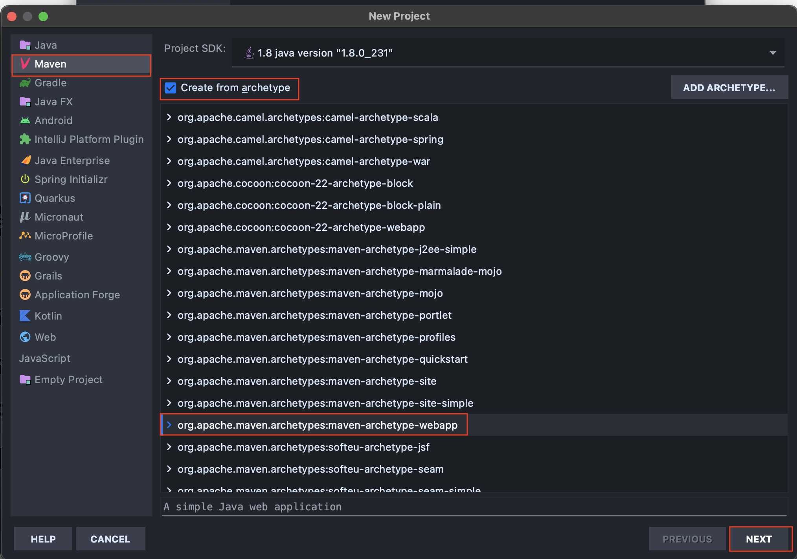
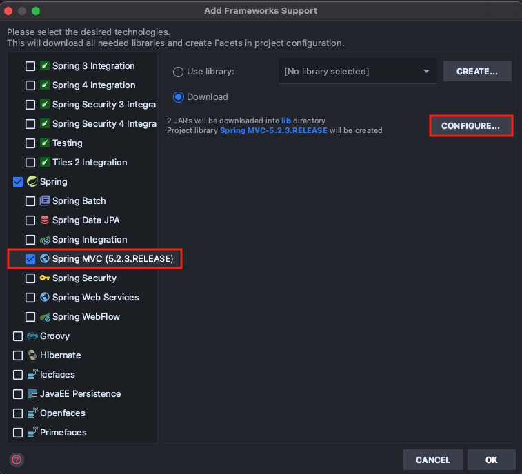
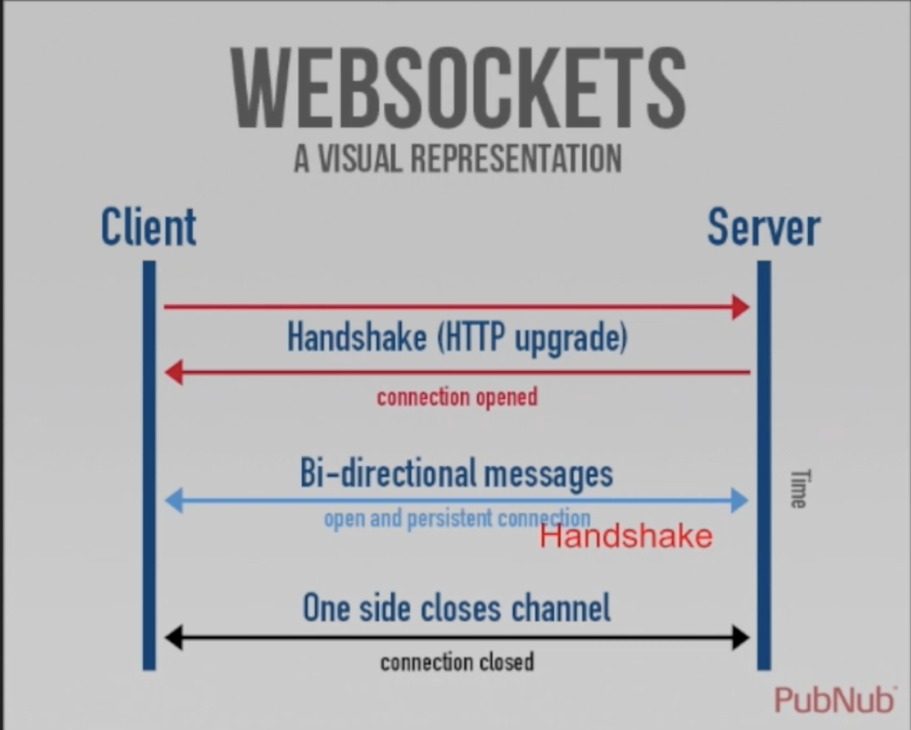

#### 최초 작성일 : 2021.09.19(일)

# Boostcourse Java Back-end 과정 학습

여기서는 Boostcourse Spring Framework Web Socket 학습을 진행한다.

## 학습 환경

1. OS : MacOS
2. JDK : OpenJDK 11.0.5
4. Build Tools : Maven
5. Database : MySQL
6. IDE: IntelliJ IDEA Ultimate

## IntelliJ Spring Framework 프로젝트 설정 방법

### Maven 프로젝트 설정

1. IntelliJ에서 New Project 선택
   
2. `Maven` 선택, `org.apache.maven.archetypes:maven-archetype-webapp` 선택 후 Next 버튼 클릭
   
3. `GroupId`, `ArtifactId`, `Version` 설정 후 Next 버튼 클릭
   
    - GroupId는 보통 프로젝트를 진행하는 회사나 팀의 도메인 이름을 거꾸로 적는다.
    - ArtifactId는 해당 프로젝트의 이름을 적는다.
    - Version은 보통 기본값(1.0-SNAPSHOT)으로 설정한다.
    - 여기서는 언급되지 않지만 `Package`라는 것이 있는데, 이는 GroupId와 ActifactId가 조합된 형태를 가진다.
4. Finish 버튼 클릭
   

### Spring Framework 프로젝트로 변경

1. 프로젝트 `우클릭 > Add Framework Support...` 클릭
   
2. Spring MVC 선택 > Configure... 클릭
   
3. Configure 확인 후 OK
    - 스프링 버전인 이후에 Maven를 사용하여 알맞게 변경할 것이기 때문에 크게 신경쓸 필요 없다.
      
4. `lib` 폴더 삭제
    - Maven 빌드 도구를 이용하여 라이브러리를 사용할 것이기 때문에 삭제한다.
      
5. File > Projecdt Structure... > Libraires에서 등록되어 있는 라이브러리 모두 삭제
   
6. `pom.xml` 내용 변경
    - Spring Framework 라이브러리 추가
    - Build 설정
   ```xml
   <?xml version="1.0" encoding="UTF-8"?>
   <project xmlns="http://maven.apache.org/POM/4.0.0"
            xmlns:xsi="http://www.w3.org/2001/XMLSchema-instance"
            xsi:schemaLocation="http://maven.apache.org/POM/4.0.0
                                http://maven.apache.org/xsd/maven-4.0.0.xsd">
       <modelVersion>4.0.0</modelVersion>
       <groupId>kr.or.connect</groupId>
       <artifactId>springwebsocket</artifactId>
       <version>1.0-SNAPSHOT</version>
       <packaging>war</packaging>
       <name>springwebsocket Maven Webapp</name>
       <url>http://www.example.com</url>
       <properties>
           <project.build.sourceEncoding>UTF-8</project.build.sourceEncoding>
           <maven.compiler.source>11</maven.compiler.source>
           <maven.compiler.target>11</maven.compiler.target>
           <spring-version>4.3.5.RELEASE</spring-version>
       </properties>
   
       <dependencies>
           <!-- Spring Framework 라이브러리 추가 -->
           <dependency>
               <groupId>org.springframework</groupId>
               <artifactId>spring-context</artifactId>
               <version>${spring-version}</version>
           </dependency>
   
           <!-- Spring MVC 라이브러리 추가 -->
           <dependency>
               <groupId>org.springframework</groupId>
               <artifactId>spring-webmvc</artifactId>
               <version>${spring-version}</version>
           </dependency>
   
           <!-- JUnit 테스트 라이브러리 추가 -->
           <dependency>
               <groupId>junit</groupId>
               <artifactId>junit</artifactId>
               <version>4.11</version>
               <scope>test</scope>
           </dependency>
       </dependencies>
   
       <build>
           <finalName>springwebsocket</finalName>
           <!-- lock down plugins versions to avoid using Maven defaults (may be moved to parent pom) -->
           <pluginManagement>
               <plugins>
                   <plugin>
                       <artifactId>maven-clean-plugin</artifactId>
                       <version>3.1.0</version>
                   </plugin>
                   <!-- see http://maven.apache.org/ref/current/maven-core/default-bindings.html#Plugin_bindings_for_war_packaging -->
                   <plugin>
                       <artifactId>maven-resources-plugin</artifactId>
                       <version>3.0.2</version>
                   </plugin>
                   <plugin>
                       <artifactId>maven-compiler-plugin</artifactId>
                       <version>3.8.0</version>
                   </plugin>
                   <plugin>
                       <artifactId>maven-surefire-plugin</artifactId>
                       <version>2.22.1</version>
                   </plugin>
                   <plugin>
                       <artifactId>maven-war-plugin</artifactId>
                       <version>3.2.2</version>
                   </plugin>
                   <plugin>
                       <artifactId>maven-install-plugin</artifactId>
                       <version>2.5.2</version>
                   </plugin>
                   <plugin>
                       <artifactId>maven-deploy-plugin</artifactId>
                       <version>2.8.2</version>
                   </plugin>
               </plugins>
           </pluginManagement>
       </build>
   </project>
   ```
7. web.xml 내용 변경
    - 여기서는 XML 설정 파일이 아닌 `Java Config 파일`을 통해 Spring 설정을 읽어 들이도록 설정하였음.
   ```xml
   <?xml version="1.0" encoding="UTF-8"?>
   <web-app xmlns="http://xmlns.jcp.org/xml/ns/javaee"
            xmlns:xsi="http://www.w3.org/2001/XMLSchema-instance"
            xsi:schemaLocation="http://xmlns.jcp.org/xml/ns/javaee
                                http://xmlns.jcp.org/xml/ns/javaee/web-app_3_1.xsd" version="3.1">
       <display-name>Archetype Created Web Application</display-name>
       <servlet>
           <servlet-name>mvc</servlet-name>
           <servlet-class>org.springframework.web.servlet.DispatcherServlet</servlet-class>
           <init-param>
               <param-name>contextClass</param-name>
               <param-value>org.springframework.web.context.support.AnnotationConfigWebApplicationContext</param-value>
           </init-param>
           <init-param>
               <param-name>contextConfigLocation</param-name>
               <param-value>kr.or.connect.springwebsocket.WebMvcContextConfiguration</param-value>
           </init-param>
           <load-on-startup>1</load-on-startup>
       </servlet>
       <servlet-mapping>
           <servlet-name>mvc</servlet-name>
           <url-pattern>/</url-pattern>
       </servlet-mapping>
   </web-app>
   ```

### WAS(Tomcat 8.5) 설정

1. IntelliJ `우측 상단 Add Configuration...` 클릭
   
2. `+ 버튼 > Tomcat Server > Local`을 선택하여 톰캣 설정
   
3. Deployment, Application context 설정
   

## Spring Web Sockets

## 소개

1. Web Socket이란 사용자의 브라우저와 서버 사이의 인터렉티브 통신 세션을 설정할 수 있게 하는 고급 기술이다.
    - [Mozilla Web Socket](https://developer.mozilla.org/ko/docs/WebSockets)
2. Socket over HTTP
    - `ws://`: HTTP 기반
    - `wss://`: HTTPS 기반
3. Full duplex, 2-way communication
    - 양쪽이 강하게 `Long Polling` 되어 있다.
        - 서버와 클라이언트가 끊어짐 없이 계속 연결된 상태
4. Polling, Long Polling
    - Polling: 자신의 요청에 의한 응답이 와도 끊어지지 않음
    - Long Polling: 양쪽 모두를 강하게 연결하고 있는 상태
5. Auto-recoonect with intelligence
    - 끊어지면 다시 연결
        - 서버 또는 클라이언트에서 설정해야 한다.
          

### 스프링 소켓 종류

#### WebSocket

1. W3C 표준
2. Socket Over HTTP
    - 웹 상에 존재
    - `ws://`: HTTP 기반
    - `wss://`: HTTPS 기반
3. IE 10+ (Can use pure WebSocket javascript library)

#### SockJS

1. 브라우저의 Socket을 사용
2. Like socket.io(NodeJS) Polyfill
3. IE 8+ (Use sockjs-client library)
    - `CDN`
   ```html
   <script src="https://cdnjs.cloudflare.com/ajax/libs/sockjs-client/1.5.2/sockjs.min.js"></script>
   ```

#### STOMP(Streaming Text Oriented Messaging Protocol): 토픽 구독 방식

1. Spring Only, Publish(topic/queue) & Subscribe
2. Sub protocol over SockJS
    - Custom foramt for message
3. Use stomp js library
    - `CDN`
   ```html
   <script src="https://cdnjs.cloudflare.com/ajax/libs/stomp.js/2.3.3/stomp.min.js"></script>
   ```
4. WebSocket, SockJS 방식과는 다르게 MessageHandler를 따로 구현하지 않는다.
    - 기본적으로 `@Controller를 이용해서 처리`하기 때문에 Web MVC 방식과 거의 유사한 형태의 개발을 진행할 수 있다.

### 웹 소켓 사용을 위한 라이브러리 설정

```xml
<dependencies>
    <dependency>
        <groupId>javax.websocket</groupId>
        <artifactId>javax.websocket-api</artifactId>
        <version>1.1</version>
    </dependency>

    <dependency>
        <groupId>org.springframework</groupId>
        <artifactId>spring-websocket</artifactId>
        <version>${spring-version}</version>
    </dependency>

    <!-- STOMP 메시징 사용을 위한 라이브러리 설정 -->
    <dependency>
        <groupId>org.springframework</groupId>
        <artifactId>spring-messaging</artifactId>
        <version>4.3.25.RELEASE</version>
    </dependency>
</dependencies>
```